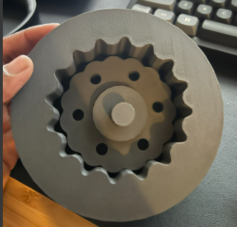
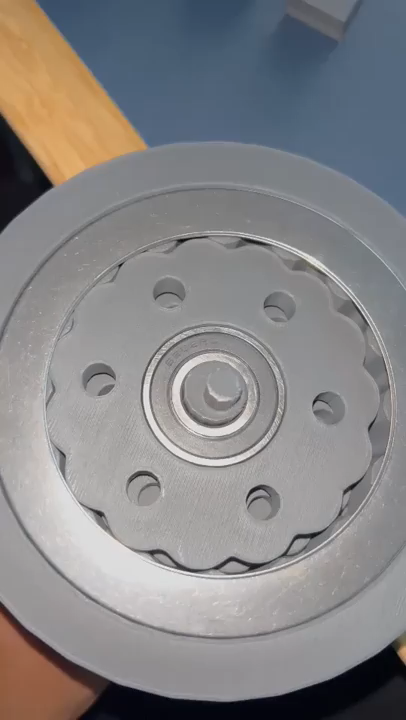
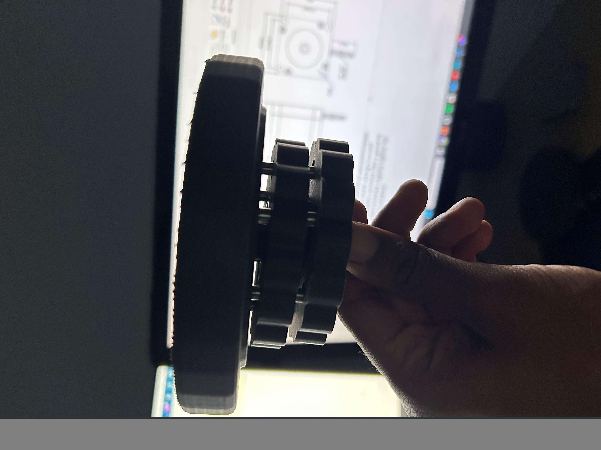
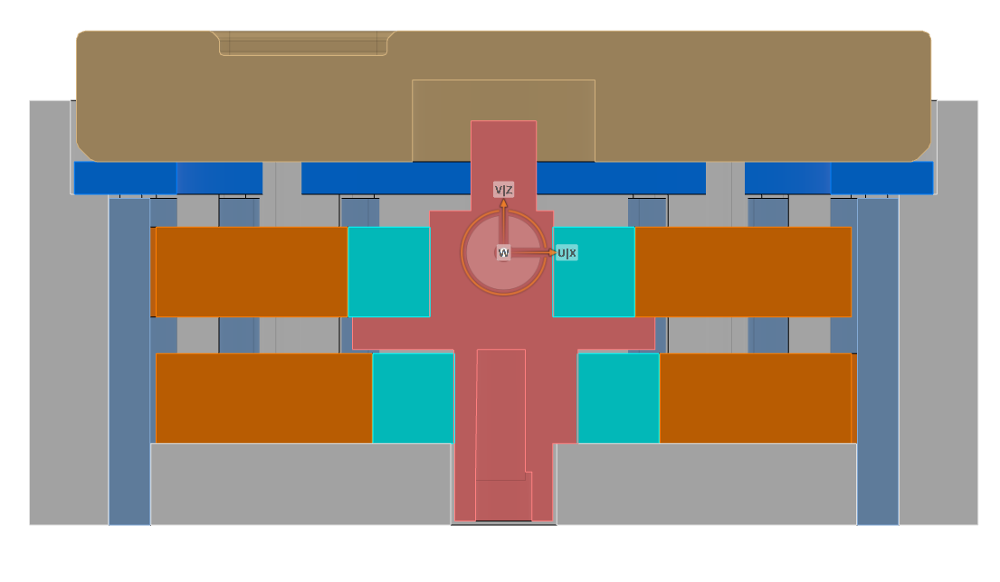

# Cycloidal Gearbox

Custom **15:1 3D-printed cycloidal drive** designed from parametric first principles. Originally developed as a rotating base actuator for a personal project, now being repurposed as the joint actuator for [ALFRED](https://github.com/harrisonshan13/6DOF), a 6DOF robotic arm.

## Design targets
- **15:1 reduction ratio** (single-stage cycloidal)
- **FDM-printable** with only standard off-the-shelf hardware (bearings, dowel pins, thrust bearing)
- Sub-1° angular accuracy at output
- Compact envelope suitable for robotic joints

## Assembly overview

## Development

Iterated through **4 hardware prototypes** to characterize FDM manufacturing tolerances (±0.2 mm on lobe diameter), sliding vs. rolling friction at output pins, and stepper misstep behavior under load. Introduced **needle bearings on the output pins** to convert sliding to rolling contact.

### First iteration

### Final iteration (V1)

## Current work

Redesigning from scratch to a **44 mm OD** package — roughly **60% smaller** than the first version — to fit inside the ALFRED joint housings.

## Contact

Harrison Lanfrank — harrisonshan13@gmail.com
